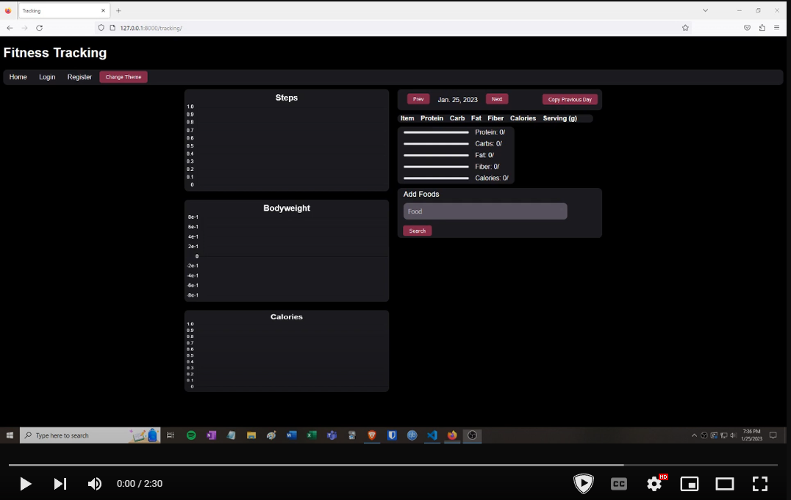

# fitness

This is an all-in-one health monitoring website, where you can log your daily nutrition (macronutrients, calories), body weight, and even pull daily step counts from your garmin smartwatch.

Key features include: automatic syncing with smartwatch health data, querying nutrition data from USDA food database, and customizable nutrition goals.

The search bar uses JavaScript to fetch data results for the desired food. An autocomplete dropdown menu is enabled by listening for keystrokes and sending the current query to the USDA database and the results are appended to the search element. Upon the next keystroke, the previous results are destroyed and replaced with the new query.

Once a search is performed the user can add any resulting food and quantity to their daily log. This is enabled with JavaScript, with edit and remove buttons in case a user makes a mistake or changes their plan. The daily totals and progress bars for nutrition data are also updated upon any change in the food log.

User preferences, goals are stored in a User model while each day's health metrics (steps, bodyweight, and nutrition) are kept in a Metrics model, that's constrained to be unique based on the User and the date.

Users can update their settings on the settings page. They can change their macronutrient targets (protein, carbs, fats) and fiber, as well as sync their step counts from their smartwatch. Currently only Garmin smartwatches are supported. Sadly Garmin only gives API keys to companies so I had to get creative to solve this. I found an API wrapper, Python: Garmin Connect, that allows you to make request data for your Garmin account. Users can manually sync their step data, or they can set up automatic syncing. With automatic syncing enabled, the program will collect the previous days step data (the current days data isn't available on Garmin Connect yet).

Users are prompted for their bodyweight on each new day.

Daily total steps, bodyweight, and calories are displayed on three charts using Chart.js.

The layout is responsively designed with flexboxes, to accommodate varying device sizes. Users can also choose between a light and dark theme.

